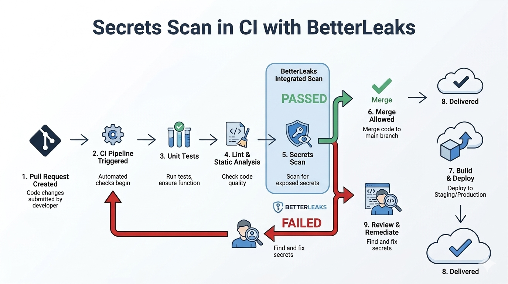
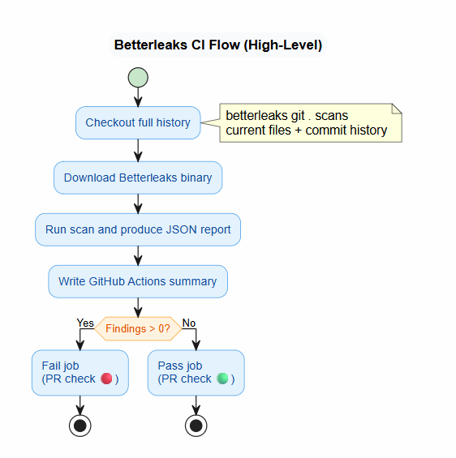

<details open>
<summary><strong>🇹🇷 Türkçe</strong></summary>
<br>

Bu belge, LearnOps reposuna Betterleaks tabanlı secret scanning kontrolünün neden eklendiğini, CI/CD içindeki çalışma şeklini ve ekip için beklenen incident response akışını açıklar.

---

## Amaç

LearnOps; FastAPI, Next.js ve PostgreSQL ile geliştirilen, topluluk odaklı bir DevOps öğrenme platformudur. Topluluğa açık bir projede çok sayıda contributor, pull request ve hızlı iterasyon bulunur. Bu hız, geliştirme verimini artırırken en sık ve en maliyetli risklerden birini de büyütür: yanlışlıkla secret expose edilmesi.

Secret sızıntıları günlük geliştirme akışı içinde beklenmedik şekillerde ortaya çıkabilir:

- Debug sırasında `.env` içinden bir satırın kopyalanması
- Test amaçlı geçici bir API key eklenmesi
- README, script veya örnek komuta token yapıştırılması

LearnOps'ta zaten test ve lint kontrolleri bulunuyordu. Ancak secret tespiti manuel ve tutarsızdı. Bu nedenle PR aşamasında otomatik, hızlı, tekrar edilebilir ve zorunlu bir güvenlik kapısı eklemek istedik.

---

## Betterleaks Nedir?

Betterleaks, Git repository'leri için tasarlanmış bir secret scanner'dır. Hem working tree'yi hem de Git history'yi tarayabilir, pattern tabanlı tespit yapar ve pull request pipeline'larında çalışabilecek kadar hafiftir.

LearnOps için tercih edilme nedenleri:

1. PR dostu olması
2. Git history tarayabilmesi
3. GitHub Actions ile kolay entegre olması
4. Basit ama etkili bir ilk güvenlik katmanı sağlaması

---

## LearnOps İçindeki Entegrasyon

Mevcut pipeline zaten şu kontrolleri çalıştırıyordu:

- Backend testleri
- Backend linting (`ruff` + `mypy`)
- Frontend lint ve type checks

Bunlara ek olarak ayrı bir `betterleaks` işi eklendi.

Temel gereksinimlerimiz şunlardı:

- `develop`, `release` ve `main` hedefli PR'larda çalışması
- Yalnızca o anki dosyaları değil, tüm Git history'yi taraması
- Reviewer'lar için net bir sonuç özeti üretmesi
- Leak bulunduğunda workflow'u fail etmesi

Docker tabanlı bir action yerine binary doğrudan GitHub runner içinde indirilip çalıştırıldı. Böylece:

- Workflow içinde Docker CLI bağımlılığı oluşmadı
- Container içindeki `safe.directory` sorunlarıyla uğraşmak gerekmedi



---

## CI Akışı

Workflow dosyası: `.github/workflows/ci-betterleaks.yaml`

Yüksek seviyede akışın mantığı şu şekildedir:

1. `actions/checkout@v4` ile repo tam history ile çekilir.
2. Betterleaks binary'si GitHub Releases üzerinden pin'lenmiş bir versiyonla indirilir.
3. `./betterleaks git . --report-format json --report-path betterleaks.json --redact=100` komutu çalıştırılır.
4. JSON rapordan bulgu sayısı hesaplanır.
5. GitHub Actions summary içine `## Betterleaks Summary` bölümü yazılır.
6. Bulgu sayısı `0` değilse job fail edilir.

Bu tasarım önemlidir; çünkü Betterleaks tek başına merge bloklamaz. Merge'i engelleyen şey, fail olan CI kontrolünün branch protection tarafından required check olarak tanımlanmış olmasıdır.



---

## Önemli Güvenlik Notu

Buradaki en kritik nokta şudur:

Bir kişi secret'i kendi branch'ine push ettiği anda, secret zaten expose olmuş sayılır.

Yani PR'da Betterleaks'in secret'i tespit etmesi çok değerlidir; ancak bu tespit, exposure gerçeğini geri almaz. Bu nedenle bir secret tespit edildiğinde ilk ve en acil aksiyon secret'in rotate edilmesidir.

Önerilen acil aksiyon sırası:

1. Expose olan secret'i hemen iptal et veya rotate et
2. Gerekirse ilgili servislerde aktif session / token etkisini değerlendir
3. Repo geçmişinde veya branch'te kalan izleri temizle
4. Pull request'i ancak rotation tamamlandıktan sonra düzelt

Özetle: CI detection bir koruma katmanıdır, ama incident response'un ilk adımı her zaman secret rotation olmalıdır.

---

## Neden Sadece PR Aşamasında Yetinmemeliyiz?

PR seviyesindeki tarama merge öncesi koruma sağlar, ancak exposure daha erken bir anda, yani push anında gerçekleşebilir. Her push'ta GitHub Actions ile scan çalıştırmak teorik olarak mümkün olsa da bu yaklaşım:

- GitHub Actions kotasını daha hızlı tüketir
- Geri bildirim döngüsünü gereksiz şekilde uzatabilir
- Her küçük push için merkezi altyapıya yük bindirir

Bu nedenle daha pratik yaklaşım, CI taramasını korurken lokal tarafta da tarama yapmaktır.

---

## Önerilen Yaklaşım: Lokal Betterleaks + Pre-Push Kontrolü

En iyi geliştirici deneyimi için şu model önerilir:

- Betterleaks CI içinde zorunlu olarak çalışmaya devam eder
- Her geliştirici Betterleaks'i kendi bilgisayarına kurar
- `git push` öncesinde lokal tarama çalıştırılır

Bu modelin faydaları:

- Secret'lar merkezi repoya gitmeden önce yakalanır
- Geri bildirim saniyeler içinde geliştiricinin makinesinde görülür
- GitHub Actions kotası gereksiz yere harcanmaz
- CI yine son savunma hattı olarak kalır

Basit bir örnek akış:

```bash
betterleaks git .
```

Eğer komut bulgu üretirse push iptal edilir ve developer önce secret'i kaldırır, gerekiyorsa rotate eder, sonra tekrar dener.

`pre-push` hook standardizasyonu bu dokümanda yapılmış bir uygulama değil, gelecekte değerlendirilebilecek bir iyileştirme önerisidir. Bu adım uygulanacaksa ayrı bir iş kartı açılarak planlanmalı; mevcut durumda bunu `v2.0` kapsamında değerlendirilebilecek bir geliştirme olarak ele alıyoruz.

---

## PR Sırasında Beklenen Davranış

Bir PR açıldığında:

- Betterleaks diğer kalite kontrolleriyle birlikte çalışır
- Leak bulunmazsa job yeşil olur ve summary `Findings: 0` gösterir
- Leak bulunursa job kırmızı olur ve required check ise merge bloklanır

Bu davranış, LearnOps'ta test ve lint kontrollerine benzer şekilde security kontrolünü de birinci sınıf CI gereksinimi haline getirir.

---

## Release Safety'ye Katkisi

Bu değişiklik sadece yeni bir job eklemek değildir. Şu güvenlik pratiklerini standardize eder:

- Tutarlılık: Her PR aynı şekilde taranır
- Tekrarlanabilirlik: Sonuç kişiye göre değişmez
- Görünürlük: Summary reviewer için hızlı karar desteği sağlar
- Zorunluluk: Branch protection ile birlikte merge öncesi kontrol haline gelir

Topluluk odaklı bir projede bu, contributor'ların hızlı çalışırken daha güvenli hareket etmesini sağlar.

---

## Kısa Sonuç Tablosu

| Konu | Net Sonuç |
|---|---|
| Secret push edilirse ne olur? | Secret expose olmuş kabul edilir |
| İlk aksiyon ne olmalı? | Secret hemen revoke veya rotate edilmelidir |
| CI taraması ne sağlar? | PR aşamasında görünür ve zorunlu bir kontrol sağlar |
| Tek başına yeterli mi? | Hayır, lokal tarama ile desteklenmelidir |
| `pre-push` hook durumu nedir? | Bu dokümanda öneri seviyesindedir; uygulanacaksa ayrı kartla planlanmalıdır |

</details>

<details>
<summary><strong>🇬🇧 English</strong></summary>
<br>

This document explains why Betterleaks-based secret scanning was added to the LearnOps repository, how it works in CI/CD, and what incident response flow the team should follow when a secret is detected.

---

## Purpose

LearnOps is a community-driven DevOps learning platform built with FastAPI, Next.js, and PostgreSQL. In an open collaboration model, many contributors, pull requests, and fast iteration increase one of the most common and expensive risks in software delivery: accidental secret exposure.

Secrets can leak through normal day-to-day development tasks:

- Copying a line from `.env` while debugging
- Adding a temporary API key for testing
- Pasting a token into a README, script, or example command

The project already had tests and lint checks in place, but secret detection was still manual and inconsistent. We wanted an automated, fast, repeatable, and enforced security gate at the pull request stage.

---

## What Is Betterleaks?

Betterleaks is a secret scanner built for Git repositories. It can scan both the working tree and Git history, uses pattern-based detection, and is lightweight enough to run in pull request pipelines.

It was a good fit for LearnOps because it is:

1. Fast enough for PR workflows
2. Git-aware, including history scanning
3. Easy to integrate into GitHub Actions
4. A practical first security layer without heavy platform setup

---

## Integration in LearnOps

The pipeline already included:

- Backend tests
- Backend linting (`ruff` + `mypy`)
- Frontend lint and type checks

We added a separate `betterleaks` job.

The core requirements were:

- Run on PRs targeting `develop`, `release`, and `main`
- Scan full Git history, not only the current snapshot
- Produce a clear reviewer-facing summary
- Fail the workflow when leaks are found

Instead of using a Docker-based action, the workflow downloads and runs the Betterleaks binary directly on the GitHub runner. This keeps the setup simpler and avoids:

- A Docker CLI dependency in the workflow
- `safe.directory` issues caused by containerized execution


---

## CI Flow

Workflow file: `.github/workflows/ci-betterleaks.yaml`

At a high level, the flow is:

1. Check out the repository with full history.
2. Download a pinned Betterleaks binary from GitHub Releases.
3. Run `./betterleaks git . --report-format json --report-path betterleaks.json --redact=100`.
4. Count findings from the JSON report.
5. Write a `## Betterleaks Summary` section to the GitHub Actions summary.
6. Fail the job if the findings count is not `0`.

That last point matters. Betterleaks itself does not block merges. The merge is blocked because the CI job fails, and branch protection can require that check to pass.


---

## Critical Security Note

This is the most important point to make explicit:

Once someone pushes a secret to their branch, the secret should already be treated as exposed.

That means PR-time detection is still valuable, but it does not undo the exposure. Because of that, the first and most urgent action after detection must be rotating or revoking the secret.

Recommended immediate response order:

1. Revoke or rotate the exposed secret immediately
2. Assess any downstream impact on sessions, tokens, or connected services
3. Clean the remaining traces from the branch or repository history if needed
4. Only then continue with the PR fix

In short: CI detection is a guardrail, but secret rotation is the first response step.

---

## Why PR-Only Scanning Is Not Enough

PR-level scanning protects the merge path, but exposure may happen earlier at push time. Running GitHub Actions on every push is possible, but it also:

- Consumes GitHub Actions quota more quickly
- Slows feedback for small iterative pushes
- Adds unnecessary load to centralized CI

Because of that, the more practical model is to keep CI scanning and add local scanning before push.

---

## Recommended Model: Local Betterleaks + Pre-Push Checks

The recommended operating model is:

- Betterleaks stays mandatory in CI
- Each developer installs Betterleaks locally
- Developers run a scan before `git push`

Benefits of this approach:

- Secrets are caught before they reach the shared repository
- Feedback comes back within seconds on the developer machine
- GitHub Actions quota is used more efficiently
- CI still remains the final safety net

A simple local command example:

```bash
betterleaks git .
```

If the command reports findings, the push should be stopped, the secret should be removed, and if the secret was ever valid or reachable, it should be rotated before trying again.

`pre-push` hook standardization is not implemented as part of this document. It should be treated as a future improvement and, if the team wants to adopt it, planned through a separate work item. For now, it is better framed as something that can be evaluated in `v2.0`.

---

## Expected PR Behavior

When a PR is opened:

- Betterleaks runs alongside the existing quality checks
- If no leaks are found, the job passes and the summary shows `Findings: 0`
- If leaks are found, the job fails and the PR stays blocked when the check is required

This makes secret scanning a first-class CI requirement, just like tests and linting.

---

## Release Safety Impact

This change is more than just another CI job. It standardizes several security practices:

- Consistency: every PR is scanned
- Repeatability: the result does not depend on reviewer attention
- Visibility: the summary makes results easy to understand
- Enforcement: branch protection turns the scan into a merge gate

For a community-driven project like LearnOps, this helps contributors move quickly without weakening the release process.

---

## Quick Summary Table

| Topic | Takeaway |
|---|---|
| What happens if a secret is pushed? | It should already be treated as exposed |
| What is the first response step? | Revoke or rotate the secret immediately |
| What does CI scanning provide? | A visible and enforceable PR-stage control |
| Is CI alone enough? | No, it should be complemented with local scanning |
| What is the status of `pre-push` hooks? | They are only a future improvement idea unless planned in a separate task |

</details>
